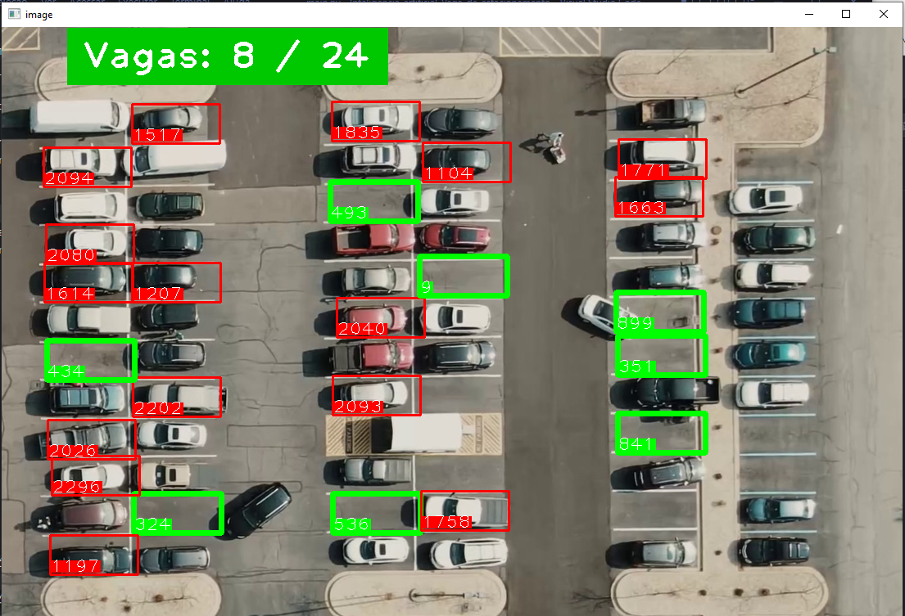

# INTELIGÊNCIA ARTIFICIAL
## DETECTAR E CALCULAR VAGAS NO ESTACIONAMENTO
#
**CRIE UM AMBIENTE VIRTUAL E ISNTALA AS DEPENDENCIAS**
~~~ shell
pip install -r requirements.txt
~~~

**Intuito do projeto é detectar vagas no estacionamento, método simples e prático**

**Para roda basta abrir o `ParkingSpacePicker.py` e selecionar as vagas com click `esquerdo` do mouse e pode remover com lado `direito`, para salvar e sair, basta pressionar a tecla `q`.**

**Após fazer o passo a passo acima é só abrir o `main.py` e seu script estará funcionando normalmente.**

